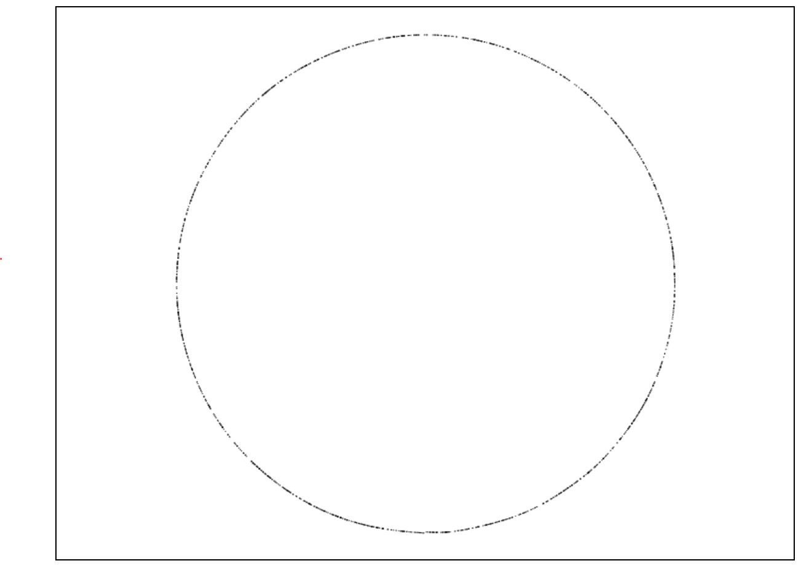

# PyTorch Model to JavaScript Sample

A simple example showing how to compile a PyTorch model to raw JavaScript.

Running the training script will train a model to approximate a circle, then open the .html file.

```
python3 train.py
```


